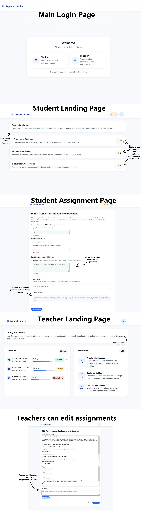

A demo project made for Dynamic Active: An AI-powered learning management website.

To run it yourself, make sure you either have your openrouter API key in your system variables, under OPENROUTER_API_KEY, or add a text file next to app.py named 'openrouter_key.txt', which contains the key.

Here's a showcase of what the site looks like:

